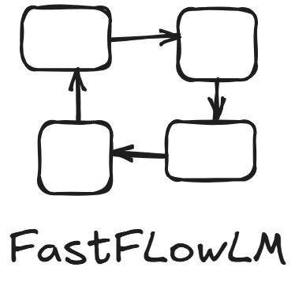

<p align="center">
  <a href="https://www.fastflowlm.com" target="_blank">
    
  </a>
</p>

<p align="center">
  
  
</p>

Run large language models on AMD Ryzen™ AI NPUs — in minutes.

FastFlowLM is a lightweight runtime for deploying LLMs like LLaMA and DeepSeek directly on AMD’s NPU — no GPU needed, faster and over 11x more power efficient than the iGPU or hybrid (iGPU+NPU) solutions.

FastFlowLM supports full context lengths — up to 128K tokens with LLaMA 3.1 and 3.2.

**Just like Ollama — but purpose-built and deeply optimized for the Ryzen™ NPU**

> FastFlowLM supports all Ryzen™ AI Series chips with XDNA2 NPUs (Strix, Strix Halo, and Kraken).

---

## 📺 Demo Videos

FastFlowLM vs AMD’s official stack (Ryzen AI software 1.4) — **real-time speedup and power efficiency**: 

- Same prompt (length: 1835 tokens), same model (LLaMA 3.2 1B model; weights int4; activation bf16), running on the same machine (AMD Ryzen AI 5 340 NPU with 32 GB SO-DIMM DDR5 5600 MHz memory)
- Real-time CPU, iGPU, NPU usage, and power consumption shown (Windows task manager + HWINFO)

<table>
  <tr>
    <td valign="top">
      <h4>🔹 FastFlowLM vs Ryzen AI SW 1.4 (NPU-only)</h4>
      <a href="https://www.youtube.com/watch?v=kv31FZ_q0_I">
        
      </a>
    </td>
    <td valign="top">
      <h4>🔹 FastFlowLM vs Ryzen AI SW 1.4 (Hybrid)</h4>
      <a href="https://www.youtube.com/watch?v=PFjH-L_Kr0w">
        
      </a>
    </td>
  </tr>
</table>

🎥 More demo videos and comparisons with Ollama and LM Studio can be found [here on YouTube](https://www.youtube.com/watch?v=OZuLQcmFe9A&list=PLf87s9UUZrJp4r3JM4NliPEsYuJNNqFAJ).

---

## 🧪 Test Drive (Remote Demo)

🚀 Skip the setup — experience FastFlowLM instantly on a live AMD Ryzen™ AI 5 340 NPU with 32 GB memory ([more spec](https://www.amazon.com/4X4-BOX-AI340-Display-Support-Copilot/dp/B0F2GFLF67/ref=sr_1_5?crid=1X16RDUCQ2497&dib=eyJ2IjoiMSJ9.C5GS4xMl_kkJ7Yr6dNFi6g.Dfj_l9Dk1yuIBjppqmKSqNAAPQc1F4Mu3zJ9-MDlszw&dib_tag=se&keywords=4x4+box+ai340&qid=1752010554&sprefix=www.amazon.com%2F4X4-BOX-AI340%2Caps%2C176&sr=8-5)):

🌐 **Launch Now**: [https://open-webui.testdrive-fastflowlm.com/](https://open-webui.testdrive-fastflowlm.com/)  
🔐 **Login**: `guest@flm.npu`  
🔑 **Password**: `0000`

> Alternatively, **sign up** with your own credentials instead of using the shared guest account.
> ⚠️ Some universities or companies may **block access** to the test drive site. If it doesn't load over Wi-Fi, try switching to a **cellular network**.  
> Real-time demo powered by **FastFlowLM + Open WebUI** — no downloads, no installs.  
> Try three optimized LLaMA models: `llama3.2:1b`, `llama3.2:3b`, and `llama3.1:8b` — all accelerated on NPU.

⚠️ **Please note**:  
- FastFlowLM is designed for **single-user local use**. This remote demo machine may experience short wait times when **multiple users** access it concurrently — please be patient.
- When switching models, it may take longer time to replace the model in memory.
- Large prompts (30k+ tokens) may take longer — but it works.

---

## ⚡ Quick Start

A packaged Windows installer is available here: [**flm-setup.exe**](https://github.com/FastFlowLM/FastFlowLM/releases/download/v0.1.5/flm-setup-v0.1.5.exe). For more details, see the [release notes](https://github.com/FastFlowLM/FastFlowLM/releases/).

> ⚠️ Ensure NPU driver is **32.0.203.258** or later (check via Task Manager→Performance→NPU or Device Manager) — [Driver Download](https://www.amd.com/en/support).

After installation, open **PowerShell**. To run a model in terminal (CLI or Interactive Mode):
```
flm run llama3.2:1b
```
> Requires internet access to HuggingFace to pull (download) the optimized model kernel. The model will be downloaded to the folder: ``C:\Users\<USER>\Documents\flm\models\``. ⚠️ If HuggingFace is not directly accessible in your region, you can manually download the model and place it in this directory.

To start the local REST API server (Server Mode):
```
flm serve llama3.2:1b
```
> The model tag (e.g., `llama3.2:1b`) sets the initial model, which is optional. If another model is requested, FastFlowLM will automatically switch to it. Local server is on port 11434 (default).

For best performance, it is recommended to set the NPU power mode to **performance** or **turbo**. Open **PowerShell** and change path to:
```powershell
cd C:\Windows\System32\AMD\
```
Then, run
```powershell
.\xrt-smi configure --pmode turbo
```
> For more details about NPU power mode, refer to the [AMD XRT SMI Documentation](https://ryzenai.docs.amd.com/en/latest/xrt_smi.html).

For detailed instructions and video guides, click [Documentation](https://docs.fastflowlm.com/).

---

## 🧠 Local AI on Your NPU

FastFlowLM makes it easy to run modern LLMs locally with:
- ⚡ Fast and low power
- 🧰 Simple CLI and API
- 🔐 Fully private and offline

No model rewrites, no tuning — it just works.

---

## ✅ Features

- **Runs fully on AMD Ryzen™ NPU** — no GPU or CPU load  
- **Developer-first flow** — like Ollama, but optimized for NPU  
- **Support for long context windows** — up to 128k tokens (e.g., LLaMA 3.1/3.2)  
- **No low-level tuning required** — You focus on your app, we handle the rest

---

## ⚡ Performance

Compared to AMD Ryzen™ AI Software 1.4 (GAIA or Lemonade):

### LLM Decoding Speed (TPS: Tokens per Second)
- 🚀 Up to **14.2× faster** vs NPU-only baseline  
- 🚀 Up to **16.2× faster** vs hybrid iGPU+NPU baseline

### Power Efficiency
- 🔋 Up to **2.66× more efficient in decoding** vs NPU-only  
- 🔋 Up to **11.38× more efficient in decoding** vs hybrid  
- 🔋 Up to **3.4× more efficient in prefill** vs NPU-only or hybrid

### Latency
- ⏱️ **Matches or exceeds** TTFT (Time to First Token) of NPU-only or hybrid mode

### Benchmarks
<p style="font-size:85%; margin:0;">
📊 View the detailed results here:
<a href="https://docs.fastflowlm.com/benchmarks/" style="text-decoration:none;">
<strong>[Benchmark results]</strong>
</a>
</p>

---

## 🛠️ Instructions

[Documentation and example workflows](https://docs.fastflowlm.com/). Like Ollama, you can:
- Load and run models locally via CLI (Interactive Mode)
- Integrate into your app via a simple REST API via a local server (Server Mode)
> Compatible with tools like **Microsoft AI Toolkit**, **Open WebUI**, and more.

---

## 🔒 Proprietary Kernel Optimizations

FastFlowLM uses **proprietary low-level kernel code** optimized for AMD Ryzen™ NPUs.  
> These kernels are **not open source**, but are included as binaries for seamless integration.

The rest of the stack — CLI, model runner, orchestration — is open and developer-friendly.

---

## 📝 Licensing & Contact

- 🆓 **Deep-optimized FastFlowLM kernels** are **free for non-commercial use**  
- 💼 **Interested in commercial use?** Email us at [info@fastflowlm.edu](mailto:info@fastflowlm.edu)  
- 📦 **Want to bring your own model?** We can optimize it for FastFlowLM — just reach out!

---

## License

This repository contains two types of components:

- **Open-source components** (e.g., CLI, orchestration code) are released under the **MIT License**.
- **Proprietary binaries** (used for low-level NPU acceleration) are **not included** in this repository and are covered by **separate licensing terms**.

---

💬 **Have feedback or want early access? [Open an issue](https://github.com/fastflowlm/fastflowlm/issues/new) or reach out!**

---

## 🙏 Acknowledgements

- Powered by the advanced **AMD Ryzen™ AI NPU architecture**
- Inspired by the widely adopted [Ollama](https://github.com/ollama/ollama)
- Tokenization accelerated with [MLC-ai/tokenizers-cpp](https://github.com/mlc-ai/tokenizers-cpp)
- Chat formatting via [Google/minja](https://github.com/google/minja)
- Low-level kernels optimized using the powerful [IRON](https://github.com/Xilinx/mlir-aie/tree/main/programming_guide)+[Riallto](https://riallto.ai/)+[AIE-MLIR](https://github.com/Xilinx/mlir-aie/tree/main/mlir_tutorials)
